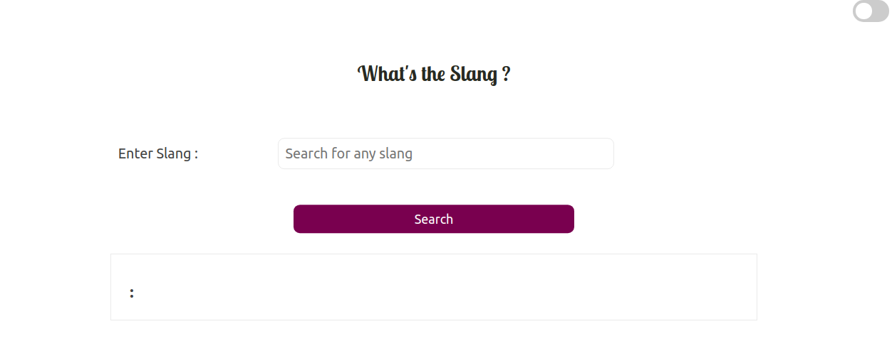
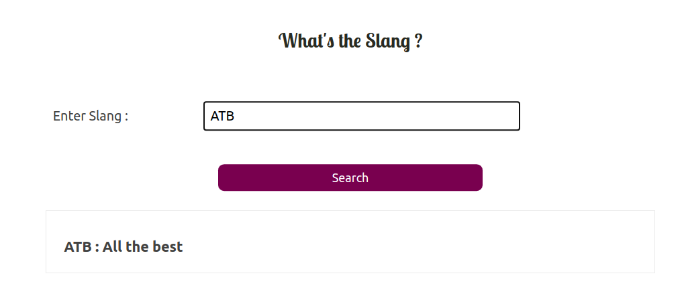
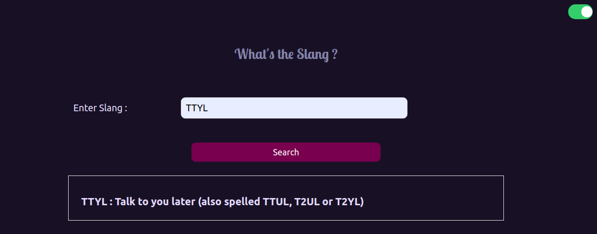

<h1 align="center">:memo: What's The Slang ❓ </h1>

🌟 An easy-to-use , easy-to-share , light-weight Slang and its meaning finder 🤩

## * Features:

* [x] Get meaning of internet slangs 📝
* [x] For new Internet comers, parents , grandparents to find slangs meanings. 
* [x] Dark mode enabled 🌚

## * Tech Stack:

* The quotes are stored in data.json scraped from https://en.wiktionary.org/wiki/Appendix:English_internet_slang using BeautifulSoup.
* HTML , CSS , JavaScript.
* Python , Django Framework

## * Demo :

